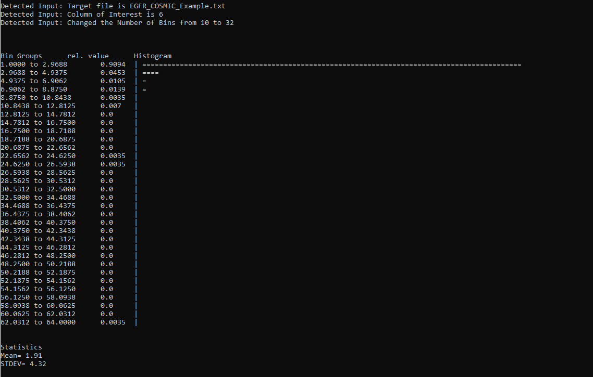

# Preface
This repository was simply made to get used to github. Due to the simplicity of the script shown here, it can mostly be ignored. Cheers.

## Requirements
  


## histogrammer.py
This **Python 2.7** script will take a numeric column of a given file and plot a histogram in the command line.
The purpose of doing so is solely to get an overview of the inspected data, and how this data is distributed.
Equal sized Groups will be formed according to the highest value of the given column divided by the number of bins.
After assigning counts into each group the script will normalize the values from 0 to 1.
The histogram is then plotted using = for each 0.005 of the normalized value. If one bin holds more than 90 % of the data, all bars are shrinked by 50 %.

## How to use:

./histogrammer.py -c NUM -f FILEPATH [OPTIONS] -h -g SYMBOL -s SEPARATOR -b SIZE -k VALUE

 	-c	NUM defines the target column
	-f	FILEPATH determines the target file
	-h	prints this help text
	-s	SEPARATOR sets the field-delimiter in the target file, default is \"\t\" (tab)
	-g	SYMBOL can either be \"#\" or = or '0' or 'o' or '.' to plot the histogram, default is =
	-b	SIZE sets the number of bins, default is 10
	-k	VALUE can be y/1 or n/0, default is n/0. Prints the column header specified with -c. Specify after -c and -f!


## Example
We can use a short dataset of somatic EGFR mutations.

Running ```./histogrammer.py -f EGFR_COSMIC_Example.txt -c 6 -b 32``` will produce:




This will tell us that **a)** the majority of somatic EGFR mutations do have a low frequency as > 90 % of all EGFR variants are only mutated between 1 - 2.9 times (the first bin) and **b)** that some residues are exceptionally often mutated, namely > 62 times.
This fits to the visual inspection over at https://cancer.sanger.ac.uk/cosmic/gene/analysis?ln=EGFR


## Add histogrammer to your .bashrc
Create a folder **.histogrammer** in your home directory and copy **histogrammer.py** into this folder. Rename the script into **histogrammer** or another name of your choice.
Locate and open the file **.bashrc** and add the following line to the end of the script:
```
export PATH=$PATH:~/.histogrammer
```
You can then call the script from anywhere on your system by typing **histogrammer**. More information on that can be found .

## Future Releases
A future release is meant to remove the *statistics* requirement, enabling the script to run on most systems supporting Python2.7. Upgrading the code to Python3 is planned, too.
